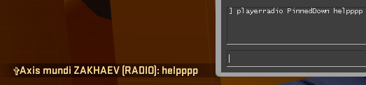

# CompleteToolCS
Simple message generator for Counter-Strike: Global Offensive,  generates ready-to-use commands (based on Source engine {C++}).
---
Includes:
#### COMMANDS 
#### COLORS 
#### RADIO COMMANDS
#### VERSION
---

Thanks to this generator u can send fake unboxed knife messages, colorful text in-game chat, custom non-know radio binds, fake VAC ban messages or even more, etc...

Feel free to use it!!! :smile::smile::smile:


#### COMMANDS

```playerradio``` - the main part of most of the commands required for the message working

```Radio.WePlanted``` - the main part of chat commands

<br />
<br />
<br />

#### COLORS

| VALUE ASCII   | Color            | Rarity           | EM                                                              |
| ------------- |:----------------:| :---------------:|:---------------------------------------------------------------:|   
| 0x07          | RED              | Covert           |  |
| 0x10          | GOLD             | Exceedingly Rare |  |
| 0x0E          | Pinkish purple   | Classified       |  |
| 0x0C          | Dark blue        | Mil-Spec         |  |
| 0x0B          | Light blue       | Industrial grade |  |
| 0x0A          | White            | Consumer grade   |  |
| 0x03          | Yellow           | Chat color       |  |
| 0x04          | Darker green     | Green            |  |
| 0x05          | Light Green      | Green            |  |
| 0x06          | Orginal Green    | Green            |  |
| 0x0f          | Light red        | Red              |  |
| 0x02          | Pure red         | Red              |  |
| 0x08          | Grey             | CT               |  |
| NaN           | 0                | 0                |  |

<br />
<br />
<br />

#### RADIO COMMANDS


| MAIN COMMAND      | ACTION                          |
|:-----------------:|:-------------------------------:|
| playerradio       | SniperWarning                   |
| playerradio       | SpottedBomber                   |
| playerradio       | DeathCry                        |
| playerradio       | KilledMyEnemy                   |
| playerradio       | SpottedLooseBomb                |
| playerradio       | GoingToGuardLooseBomb           |
| playerradio       | WaitingForHumanToDefuseBomb     |
| playerradio       | ScaredEmote                     |
| playerradio       | OneEnemyLeft                    |
| playerradio       | TwoEnemiesLeft                  |
| playerradio       | ThreeEnemiesLeft                |
| playerradio       | PinnedDown                      |

<br />
<br />

```playerradio DeathCry Ooooo!``` - ```playerradio``` (main command), ```DeathCry``` (Action), ```Ooooo!``` (Random text)

```Command``` &nbsp; ```Action ``` &nbsp; ```Displayed text```

<br />
<br />

For example:

* ```playerradio DeathCry Hello```


<br /><br /><br />

* ```playerradio PinnedDown helpppp```


<br /><br /><br />

* ```playerradio ScaredEmote wrrrrr```


<br /><br /><br />


### Supported Versions

| Version | Supported {code}   | Features added                             | Date       | Works in game?     |
|:-------:|:------------------:| ------------------------------------------ |:----------:|:------------------:|
| V 1.3   | :white_check_mark: | *Received in trade™*                       | 05/09/2021 | :heavy_check_mark: |
| V 1.0   | :white_check_mark: | *Radio commands*                           | 27/08/2021 | :heavy_check_mark: |
| V 0.5   | :x:                | *Fake VAC message*                         | 29/06/2021 | :heavy_check_mark: |
| V 0.1   | :x:                | *Colorful text*                            | 28/06/2021 | :heavy_check_mark: |
| V 0.01  | :x:                | *Release of CompleteToolCS*                | 27/06/2021 | :heavy_check_mark: |

CURRENT VERSION: <b>V 1.3</b>
